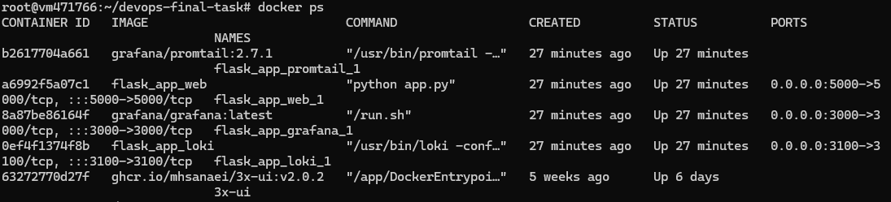

# devops-final-task

Описание приложения:

Простая аппа с 1 эндпоинтом на Flask


Инструкция:

```cd flask_app```

```./deploy.sh```


Пример рабочего аппа:





Логи в grafana:


Логируемое сообщение:


